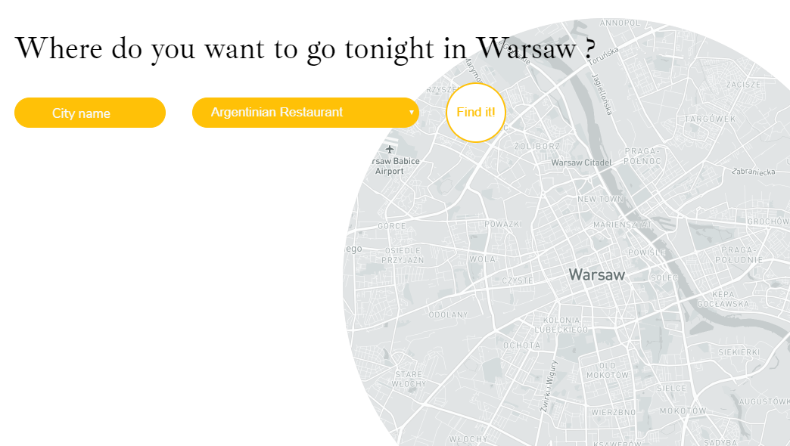

# Restaurant Finder

> This app can help you to find restaurants with cousine around the world in your city (default in Warsaw).

## General info

This App initially instantiates a Leaflet Map with a Tile Layer with Warsaw location.
You can type any other city name and choose category of restaurant from different world cousine.

## Screenshots

[Live Demo](https://unpolaco.github.io/Restaurant-Finder/)

## API

Restaurants data based on [Places Data by Foursquare](https://enterprise.foursquare.com/products/places)

## MAPS

Maps based on [Leaflet library](https://leafletjs.com/)

## Styling

This project uses [styled-components](https://styled-components.com/) to handle styling: `src/styles/theme.js` defines the styling base and `src/styles/GlobalStyles.js` includes basic element styles along with the CSS Reset.

## Technologies

- `react`: version 16.12.0
- `leaflet`: version 1.6.0
- `react-leaflet`: version 2.6.1
- `styled-components`: version 5.0.0
- `uuid`: version 3.4.0

## Installation

- Clone the repo in your terminal by clicking the _green_ clone or download button at the top right and copyin the url
- In your terminal, type `git clone URL`
  - replace URL with the url you copied
  - hit enter
- This will copy all the files from this repo down to your computer
- In your terminal, cd into the directory you just created
- Type `npm install` to install all dependencies
- Last, but not least, type `npm start` to run the app locally.
- To look at the code, just open up the project in your favorite code editor!a
